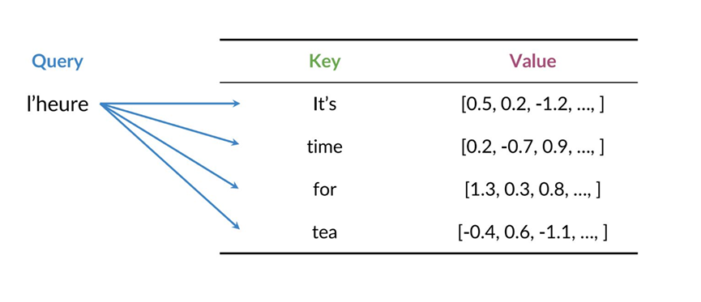
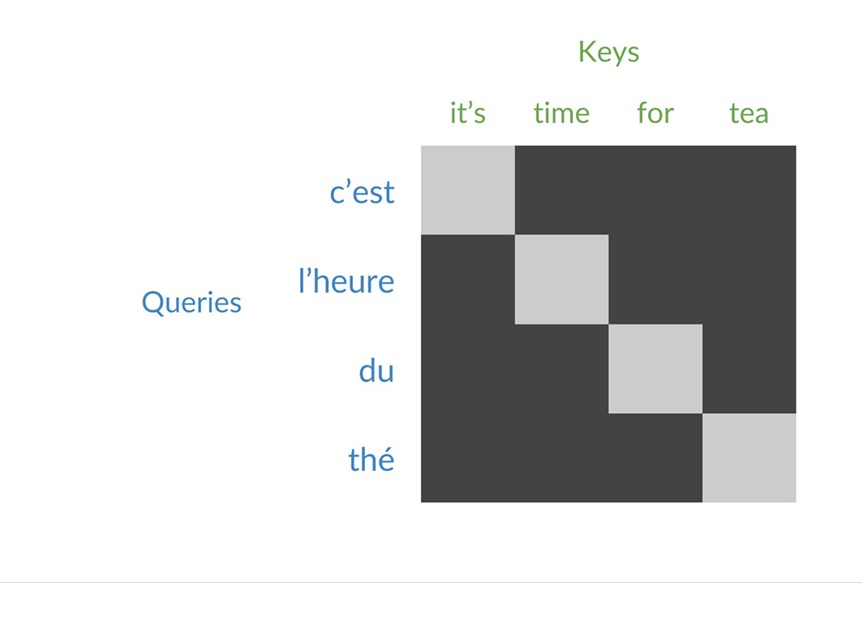

## Overview

Attention layers are now used over RNNs and even CNNs to speed up processing. In this blog we will see how attention layers are implemented.
## Working of Attention layers

There three inputs to attention layers:

1. Query: Represents the "question" or "search term" for determining which parts of the input sequence are relevant.
2. Key: Represents the "descriptor" of each input element, used to decide how relevant each input element is to the query.
3. Values: Contains the actual information or representation of each input element that will be passed along after attention is computed.

Given a Query and Key we calculate the similarity, this allows us to use the key with the max similarity and use its value for attention.

\[
     \text{Score}(Q, K) = Q \cdot K^\top
\]

The above equation results in matrix describing how much importance a query gives to a key. In the equation `Q` is the query and `K` is the key.

The next step is scaling, we perform scaling to avoid large values, larger values require more resources for computation, So now the equation takes the following shape:

\[
     \text{Scaled Score}(Q, K) = \frac{Q \cdot K^\top}{\sqrt{d_k}}
\]

Where \(d_k\) is the dimensionality of the Key vectors.

The scores are passed through a softmax function to convert them into probabilities (attention weights). These probabilities determine the contribution of each input element. The equation now takes the following form:

\[
     \text{Attention Weights} = \text{softmax}\left(\frac{Q \cdot K^\top}{\sqrt{d_k}}\right)
\]

Overall the equation would look something like this:

\[
\text{Attention}(Q, K, V) = \text{softmax}\left(\frac{QK^\top}{\sqrt{d_k}}\right) V
\]

|  | 
|:--:| 
| *Figure 1: Query Key Value* |

|  | 
|:--:| 
| *Figure 2: Flow of calculating Attention in Scaled Dot Product Attention* |

|  | 
|:--:| 
| *Figure 2: Example mapping similar query-key value pairs* |

Lets try to understand this with an analogy. Consider the example where you are visiting a library and ask for a book. You say "I want a book about science fiction", this is analogous to Query. The library uses the description of each book (Key) in the library that is similar to the customers query to recommend books that fit the genre of science fiction and provides the list of these books to the customer (Value).

Queries, Keys, and Values are computed as linear transformations of the input embeddings (or outputs of the previous layer):

  $$
Q = XW_Q, \quad K = XW_K, \quad V = XW_V
$$

  where \(X\) is the input, and \(W_Q\), \(W_K\), \(W_V\) are learned weight matrices.

## Summary

1. Attention is a layer that lets a model focus on what's important
2. Query, Values and Keys are used for information retrieval insde the attention layer.

