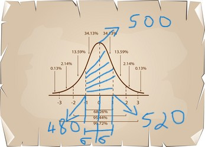

# Gaussian Distribution Problems in Interviews

## Overview

When going for any Machine Learning or Data Science Interviews, the interviewers like to check if a candidate can model a problem after a distribution. For everyone the favourite being the Gaussian Distribution. I'm sure everyone is familiar with how to do this, but to refresh everyones memory on the subject lets look at a question.

## Interview Question

On any given day the average customer visiting a store is 500 and the standard deviation is 20. What is the probability that the number of customers on any day is in the range of 480-520.

## Solution

So lets note own the details of the problem

We know that the mean $\mu$ is 500 and $\sigma$ is 20. Assuming gaussian distribution. Our model will look something like this:

So the total percentage is 68.26%