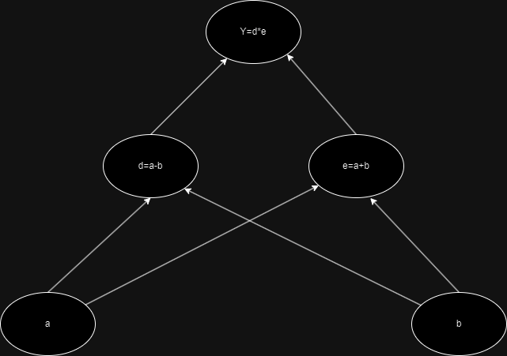

# Computational Graphs

These are Directed Graphs that helps map out dependencies for mathematical computations. For Example let us consider the following set of equations:

1. Y=(a-b)*(a+b)
2. Let d=(a-b) and e=(a+b)

Our dependency graph will look as follows:

The lower nodes are evaluated first then the higher nodes are evaluated.

Let us consider how this works when performing chain differentiation when it comes to neural networks. 

To review chain differentiation consider the follow ing 
