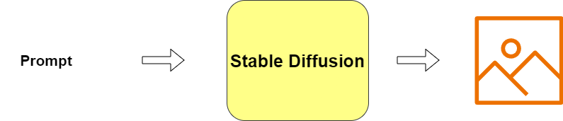
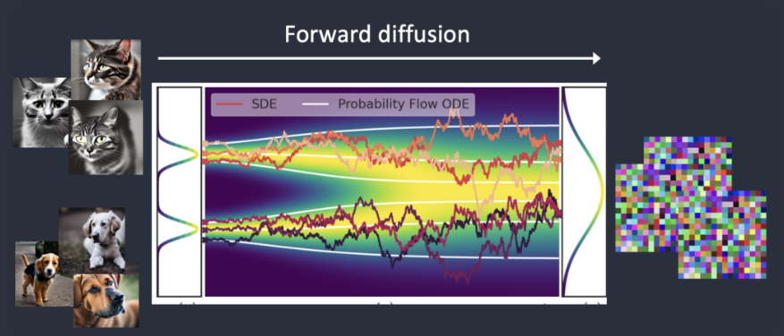
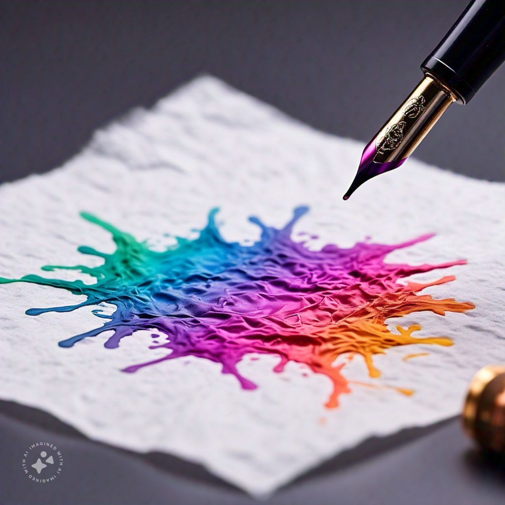
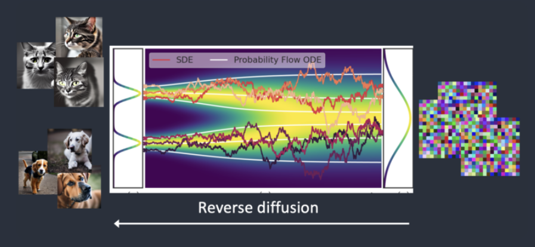
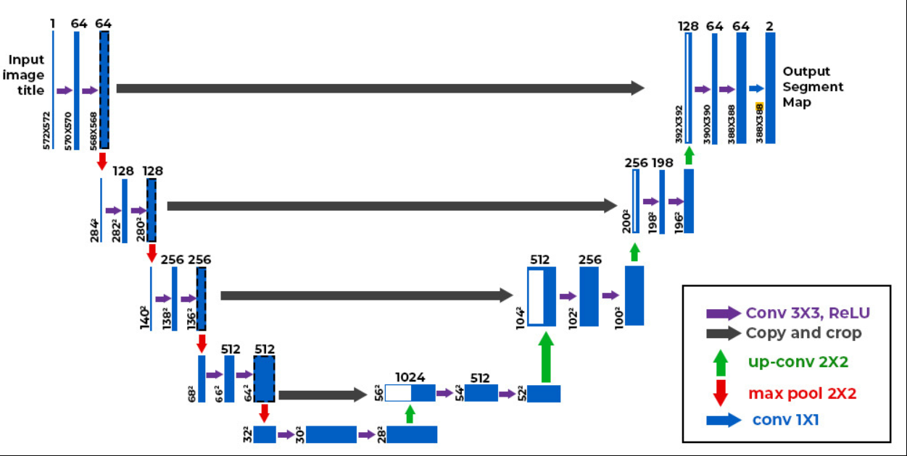
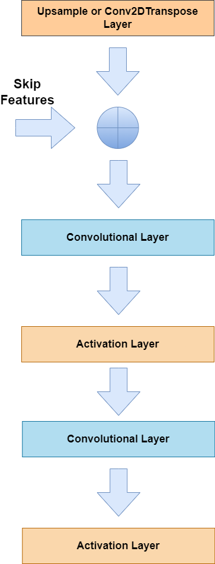
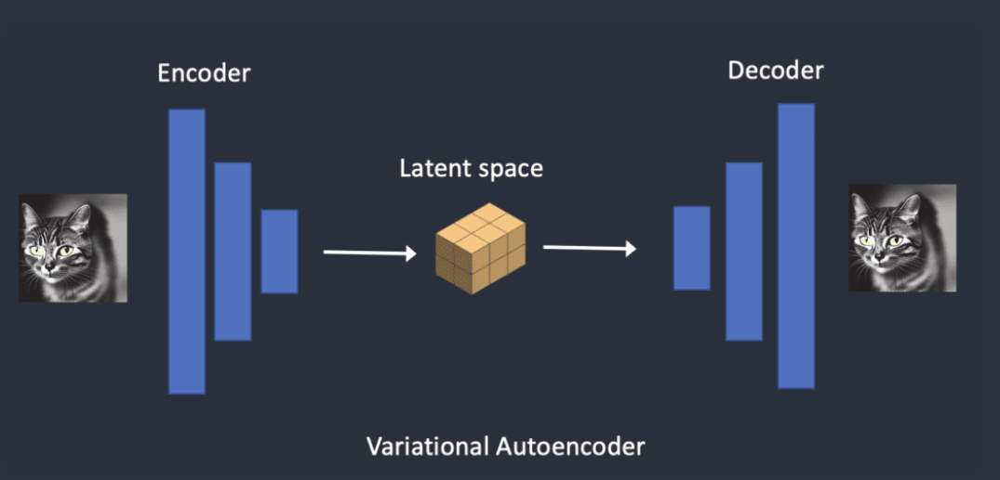
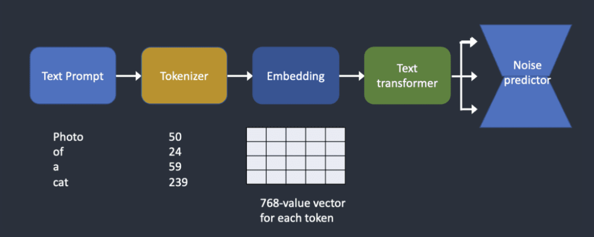

# Stable Diffusion Understanding

## Overview 

Stable Diffusion has become so popular for image generation. It is the go to model for developers. It is a latent diffusion model that generates AI images for text. Sometimes you can also use an image and text to generate images. Some important things that I would like to highlight in this blog:

1. Text-to-Image
2. Image-to-Image
3. CFG scale (Classifier Free Guidance Scale)

## Capabilities of Stable Diffussion

Stable diffusion is a text-to-image model. Given a text it will produce an image.

|  | 
|:--:| 
| *Figure 1:Basic Workflow of Stable Diffusion* |

Stable diffusion belongs to a class of deep learning models called diffusion models. These are models that are capable of generating new data that is similar to the training data. These models are so named since they use diffusion based mechanics we see in physics. We see two types of diffusion here:
1. Forward Diffusion
2. Reverse Diffusion

### Forward Diffusion

Forward diffusion is the process that adds noise to an image in steps such that it gradually becomes unrecognizable. It is similar to the process where you drop ink on tissue paper the ink eventually spreads out.

|  | 
|:--:| 
| *Figure 2: Stable diffusion Forward diffusion process taken from [here](https://stable-diffusion-art.com/how-stable-diffusion-work/)* |

|  | 
|:--:| 
| *Figure 3: Drop of ink from the nib of the pen  spreading on the tissue paper (AI Generated from LLama 3.2)* |

### Reverse Diffusion
Reverse diffusion is the opposite of Forward Diffusion. So rather than adding noise, it removes noise gradually from an image.

|  | 
|:--:| 
| *Figure 4: Stable diffusion Reverse diffusion process taken from [here](https://stable-diffusion-art.com/how-stable-diffusion-work/)* |

## Training process of Stable Diffusion

Adding noise is simple process and does not require explicit training. But how do get the old image back from a noisy image. We need to remove the noise from the image. To put it mathematically.

|  | 
|:--:| 
| *Figure 5: Stable diffusion Reverse diffusion High Level Equation* |

So what we need to do is predict the amount of noise that needs to be removed to produce the original almost noiseless image. We use a noise predictor which for stable diffusion is a U-net model.

### U-Net Model
It is a widely used deep learning model for image segmentation. The primary purpose of the model was t o address the challenge of limited data in healthcare. This network allows you to use a smalled dataset for training while maintaining the speed and accuracy of the model.

The U-Net model consists of 2 paths:

1. Contracting Path 
2. Expansive Path

The contracting path consist of encoders, that capture the relevant information and encode it. The expansive path contains decoders the decode the encoded information and also use the information from the contracting path via the skip connections to generate a segmentation map.

|  | 
|:--:| 
| *Figure 6: U-net model taken from [here](https://www.geeksforgeeks.org/u-net-architecture-explained/)* |

|  | 
|:--:| 
| *Figure 7: U-net model Encoder Architecture* |

|  | 
|:--:| 
| *Figure 8: U-net model Decoder Architecture* |

### Cost of running the model
Diffusion models like Google’s Imagen and Open AI’s DALL-E are in pixel space. They have used some tricks to make the model faster but still not enough. Whereas, Stable Diffusion is a latent diffusion model. Instead of operating in the high-dimensional image space, it first compresses the image into the latent space. The latent space is 48 times smaller so it reaps the benefit of crunching a lot fewer numbers. That’s why it’s a lot faster. We use a Variational Autonencoders (VAE).

To summarise we use U-net in the image space for faster generation we make use of the latent space, for this we use VAE. U-Net is still used as the noise predictor.

### Variational Autoencoders
Like U-net these also have encoders and decodes, the noise is added to latent vector and is later decoded to generate the images.

|  | 
|:--:| 
| *Figure 9: VAE Working* |

### Does using latent space cause loss in information?

It might seem that while using the latent space we are loosing a lot of information, however thats not the case. It might seem that images are random but they are regular in nature. For Example: A face of any species has a mouth, ears and a nose. This is better explained by the Manifold Hypothesis.

### Reverse Diffusion in Latent Space

Here’s how latent reverse diffusion in Stable Diffusion works.

1. A random latent space matrix is generated.
2. The noise predictor estimates the noise of the latent matrix.
3. The estimated noise is then subtracted from the latent matrix.
4. Steps 2 and 3 are repeated up to specific sampling steps.
5. The decoder of VAE converts the latent matrix to the final image.

The noised predictor here is still U-Net.

So far we have seen only image generation process which is called the unconditioned process. In the following sections we will see how we can condition for text i.e. given a text the model should generate an image.

### Text Conditioning

To be able to generate images using the text prompts we need to perform the preprocessing steps in figure 10. In the figure the Tokenizer and Embedder are implemented by a Contrastive Language-Image Pretraining model (CLIP). It should be noted here since we are dealling with a text input the convulutional layers are replaced by cross attention layers to help establish relationship between different words

|  | 
|:--:| 
| *Figure 10: Text Conditioning steps* |

## References

1. Andrew, “How does Stable Diffusion work?,” Stable Diffusion Art, Jun. 10, 2024. https://stable-diffusion-art.com/how-stable-diffusion-work/
2. GeeksforGeeks, “UNET Architecture explained,” GeeksforGeeks, Jun. 08, 2023. https://www.geeksforgeeks.org/u-net-architecture-explained/
3. O. Ronneberger, P. Fischer, and T. Brox, “U-NET: Convolutional Networks for Biomedical Image Segmentation,” arXiv.org, May 18, 2015. https://arxiv.org/abs/1505.04597
4. Wikipedia contributors, “Manifold hypothesis,” Wikipedia, Aug. 01, 2024. https://en.wikipedia.org/wiki/Manifold_hypothesis