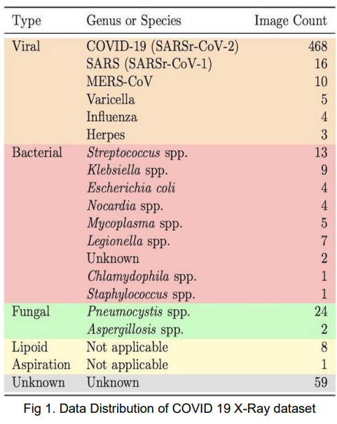
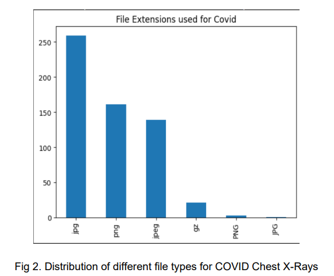

# Corona Virus Detection in Chest X-Rays
## Overview

This project is an attempt to develop a system that can classify lung X-ray images with an 
emphasis to detect X-ray images with COVID-19. In this project we will make use of image 
processing techniques learned in class and implement a classification system that can sort out 
the COVID-19 X-rays from the X-rays that are normal and have Pneumonia. This project will 
include image collection, image processing and image classification with the help of Deep neural 
networks namely CNN. As an aside we will also explore the performance of a machine learning 
model especially KNN. This project should yield a robust classifier that can help detect COVID-19 in a given image

## Introduction

The new decade of the 21st century (2020) started with the emergence of a novel 
coronavirus known as SARS-CoV-2 that caused an epidemic of coronavirus disease (COVID-19) 
in Wuhan, China. It is the third highly pathogenic and transmissible coronavirus after severe acute 
respiratory syndrome coronavirus (SARS-CoV) and Middle East respiratory syndrome 
coronavirus (MERS-CoV) emerged in humans. [6] The virus, primarily affecting the respiratory 
system, prompted a dire need for rapid and accurate diagnostic tools.
Owing to the development of molecular biology technologies, molecular diagnostic 
methods have developed rapidly. Among these, polymerase chain reaction (PCR)-based assays 
are regarded as the gold standard for virus detection because of their high sensitivity and 
specificity.[7] However, the test is too difficult to be widely used and it requires expensive 
laboratory equipment and highly-trained laboratory staff. Additionally, it faces limitations in 
sensitivity, impacting its effectiveness in certain scenarios.[8]
X-ray imaging emerged as a crucial diagnostic method due to its ability to reveal distinct 
lung patterns associated with COVID-19. Leveraging this characteristic, our project aims to 
employ advanced deep learning and machine learning models to detect COVID-19 from X-ray 
images. The researchers are trying to inculcate artificial intelligence (Machine learning or deep 
2
learning models) for the efficient detection of COVID-19.[9] By amalgamating diverse datasets 
encompassing COVID-19 X-ray images alongside normal and pneumonia-afflicted chest X-rays, 
we seek to develop an automated classification system.
This study compares the efficacy of deep learning, particularly Convolutional Neural 
Networks (CNNs), with machine learning methodologies in identifying COVID-19 patterns within 
X-ray images. The overarching goal is to contribute to the development of an intelligent diagnostic 
tool that aids healthcare professionals in swift and accurate COVID-19 diagnoses based on X-ray 
imagery.

## Background Information
### What is COVID-19?

This is a virus which has been circulating the globe since 2019 . This virus is accompanied 
by symptoms like dry cough, fever, shortness of breath and a loss of smell and taste.This was 
considered as a respiratory virus. It is reported that most cases of this disease are mild and after 
running the full course of the virus most patients recover. However, the severe course of this 
disease is pneumonia-like and may result in death. In some cases also we see symptoms like 
headaches, aching limbs, sore throat and sniffles. As a consequence of this disease, patients 
have experienced damages to their nerves and cardiovascular system. [1,2]

### Use of X Rays as an alternative to testing kit

When COVID-19 when was rampant, there was an increase in COVID-19 patients which 
strained the healthcare systems around the world. At the time when COVID-10 was at its peak, 
there were limited kits for diagnosis but also limited hospital beds, personal protective equipment 
and ventilators. Due to the sheer volume of the patients, it becomes increasingly important to 
distinguish patients with severe acute respiratory illness(SARI) and COVID-19.Soon the world 
found itself using X-rays and devising tools with the help of it to classify X-rays. X-rays are not 
only cheap but are commonly found in various diagnostic settings. Also, they are well integrated 
into the digital infrastructure. Lastly, portable X-rays also allow for the creation of makeshift 
isolation wards reducing the need of PPE kits[2].

### Related Works

This idea is not a novel idea and there are many models and works surrounding X-rays. 
Most of these use machine learning and deep learning techniques coupled with image processing 
techniques that will help classify X-Ray images. The need for such systems was spurred on by 
the lack of healthcare professionals to interpret the results. However, such systems are to be 
used for triaging purposes [2].

 
 
Some works are:
 
 

Coronet[4], which is a Deep Convolutional Neural Network model that automatically 
detects COVID-19 infection from chest X-ray images. The model the authors proposed is based 
on Xception architectures with its weights pre trained on ImageNet. Transfer learning is then done 
on the COVID-19 data set and pneumonia datasets which are publicly available. This model has 
achieved an overall accuracy of 89.6%. The model was experimented with 4 class classification 
scenarios(COVID,Pneumonia bacterial,Pneumonia viral,normal) and 3 class 
classification(COVID,Pneumonia,normal). The model achieved an overall accuracy of 89.6% and 
95% respectively.

 
 

"Automated detection of COVID-19 cases using deep neural networks with X-ray 
images''[5], makes use of deep neural networks. However, the model so developed here was 
experimented for 2 class classification(COVID, No Findings) and 3 class classification(COVID, 
No findings, Pneumonia). The paper has implemented a DarkNet model that uses a you only look 
once real time object detection system and has achieved an accuracy of 98% for binary 
classification and 87% for multiclass classification.

 
 

COVID-NET[6], it's the first open source network design for chest X-ray Images. In 
addition to this the study creates a database for COVID-19 against which we can benchmark our 
models and saves the trouble for creating the dataset. Transfer Learning approach was 
undertaken here where the COVID-NET model was first pre trained on Imagenet and then on the 
COVIDx dataset. 3 classes was used for classification and a comparison was done against other 
pretrained models like ResNET-50 and VGG-19 and COVID-NET was found to perform better 
than these models. The number of parameters and mathematical operations used in COVID-NET 
was less compared to ResNET-50 and VGG-19.

##  Implemented Method
In our project we will have the following tasks:
### Data Collection
For our project we will be collecting data from 2 data sources:
1. Covid 19 X-Ray DataSet [11]
2. Bacterial and Viral Pneumonia
### Covid 19 X-Ray DataSet
This data has the following distribution illustrated in the following image:

From this data set we take images that are labeled as COVID and the X-ray image is in the 
anteroposterior (AP) or in the anteroposterior supine position(AP Supine).

The COVID images were stored in the following formats:

###  Bacterial and Viral Pneumonia

In this data set we have a collection of chest X-rays that are either annotated as 
Pneumonia or Normal. Most of the images present in this dataset are in the AP position only. 
Pneumonia has about 4273 occurrences in the dataset whereas normal chest X-Rays has about 
1583 occurrences. 
After combining all the data our dataset size is 5855 instances of Chest X-ray images and 
our final data distribution is illustrated in Fig 3

##  Data Preparation

After collecting the data we need to ensure that images are copied to a new directory 
where they have the following structure:

20% of the dataset is reserved for testing and 20% of the training data is used for 
validation.
We perform the following transformations on the images:
1. GrayScale Conversion - All the images have the same number of channels, i.e. all the 
images should either be in RGB or grayscale. For this project we are going to convert all 
images to grayscale.
2. Resize - All the images have the same dimensions i.e. 224x224
3. Center Crop - Crops a given image at the center
4. Normalize - Normalize a given image with mean = 0.5 and standard deviation = 0.5

After doing the aforementioned processes our images will look as illustrated in Fig 4.

Optionally we also use Fourier Transform, to see whether we can improve the results.

##  Building our model
### CNN
In this project, rather than use a pretrained model, we built our own CNN Model. Our CNN 
model architecture is as follows:
1. Input Convolution layer: This layer has a width of 224 and height of 224 and is composed 
of a single channel and is processed through the convolution layer with a filter size of 7 
and stride of 4. 16 filters are used here. Our output dimensions here are 55x55x16
 
2. 1st Hidden Convolution layer: The output dimensions in the previous layer serves as the 
input here. We have 32 filters in this layer with a filter size of 5 and stride of 2. Our output 
dimensions are then 26x26x32
 
3. 1st Max Pooling Layer: The output of the previous layer is then subject to max pooling 
where the kernel size is 3 and stride is 2. The output dimensions here are 12x12x32
 
4. First Batch Normalisation layer: Batch Normalisation is performed here to speed up the 
learning process. Output dimensions are the same as the input dimensions.
 
5. 2nd Hidden Convolution layer: The input size here is 12x12x32 which then undergoes 
convolution through 64 filters with kernel size of 3 and stride of 1. The output dimension 
here then would be 10x10x64
 
6. 3rd Hidden Convolution layer: The input size is 10x10x64 which then undergoes 
convolution through 128 filters of kernel size 3 with a stride of 1. The output dimension 
here would then be 8x8x128
 
7. 2nd Max Pool layer: The input size is 8x8x128 which undergoes max pooling against 
kernel of size 3 with stride 1. The output dimension produced here is 6x6x128
 
8. 2nd Batch Normalisation layer: Batch Normalisation is performed here to speed up the 
learning process. Output dimensions are the same as the input dimensions.
 
9. Flatten Layer: The output of the Batch Normalisation layer is then flattened so that the 
dimensions are 1x4608
 
10. 1st Hidden Fully Connected Layer: The input size here is 1x4608 and the output size here 
1x100.
 
11. 1st Dropout layer: The dropout percentage is 50%
 
12. 2nd Hidden Fully Connected Layer: The input size here is 1x100 and the output size here 
is 1x50.
 
13. 2nd Dropout layer: The dropout percentage is 50%
 
14. Output layer: This is a fully connected layer whose input size is 1x50 and output is 1x3.
The activation used throughout except in the output layer is ReLU which is given in Eq5.
The output for each convolution is,
 

Where Ni is the number of data in a batch and Cout denotes the number of output channels, Cin 
denotes the number of input channels.
The output dimensions for the convolution layer are determined by the following formulas:

Where Hout and Wout are the output height and width and our final dimensions are 
(Hout,Wout,Cout). In this case padding is 0 and dilation by default is 1 for all our convolution 
layers. 
The output for our MaxPool Layers is given in the following equation:

Where h and w are our kernel sizes used in the max pooling layer.
If the input dimensions to the max pool layer is (N,C,H,W) then our output dimensions will be 
(N,C,Hout,Wout) where Hout and Wout calculations are given in Eq2.
Our batch normalization layers follow the calculations given in Eq4.

Where y is the output for a given x value and E[x] and Var[x] are the mean and variance and 
sqrt(Var(x)) is the standard deviation. These are calculated for a given batch. Gamma and Beta 
are learnable parameters. These vector sizes are the same as the channel size for the given 
input.

The optimiser used for optimization is the Adam Optimizer which is given in Fig 7.

The loss function used is Cross Entropy which is given Eq6.

### KNN
The KNN algorithm implemented in this project doesn't have a traditional architectural 
design like a neural network. It follows a more straightforward approach based on distance 
calculations and majority voting.The KNN algorithm implemented in this project follows these 
steps:

1. Retrieve Test Image - The code retrieves the test image at the current index from the 
x_test tensor. This test image represents the data point that we want to classify.
 
2. Calculate Distances to Training Set - The code calculates the Euclidean distance between 
the test image and every image in the training set. The Euclidean distance is a measure 
of similarity between two vectors. In this case, it represents the dissimilarity between the 
test image and each training image. The distances are stored in the distance tensor.

 
3. Identify K Nearest Neighbors - The code identifies the k nearest neighbors of the test 
image. This involves finding the k training images that have the smallest distances to the 
test image. The torch.topk() function is used to select the k smallest distances and their 
corresponding indices. The indices are stored in the indexes tensor.
 
4. Gather Class Labels of Nearest Neighbors - The code gathers the class labels of the k 
nearest neighbors using the torch.gather() function. The class labels are stored in the 
classes tensor.
 
5. Determine Majority Class - The code determines the majority class label among the k 
nearest neighbors using the torch.mode() function. The majority class label is the class 
label that occurs most frequently among the nearest neighbors. The majority class label 
is stored in the mode variable.
 
6. Assign Predicted Class - The code assigns the majority class label to the test image as its 
predicted class. This means that the test image is classified as the class that is most 
represented among its k nearest neighbors.
 

## Training

### CNN
We run the training for the CNN model we have designed for about 30 epochs, but the 
model doesn't necessarily train for 30 epochs since we add an early stopping condition i.e. training 
is stopped as soon as validation loss exceeds the training loss. In addition to early stopping we 
have dropout layers in place which prevent overfitting.

### KNN
The model defines a list of k_values, representing the possible values for the k 
hyperparameter in the KNN algorithm. It then iterates through these values, training and 
evaluating a KNN model for each k value.

For each k value, the code calls the model to train and evaluate the KNN model. The 
models take the training data , test data , and the k value as input. The code evaluates the 
performance of each KNN model by comparing the predicted labels to the actual labels. It 
calculates the number of correctly predicted labels and the accuracy. The accuracy represents 
the percentage of test images that were correctly classified.
The code tracks the highest accuracy achieved so far and the corresponding k value. This 
allows it to identify the optimal k value for the given dataset.

## Evaluation

## Conclusion

In this project we have done the following experiments:
1. CNN model training with Chest X-Ray images and also their fourier transform images.
2. KNN model training with Chest X-Ray images.
There were no significant improvements in the results when the fourier transformed images used 
for training in CNN. But with the fourier transformed images, the accuracy to classify COVID-19 
is slightly higher, but overall there is not much improvement. Although CNN has a higher accuracy 
than KNN, there are more computations involved, so it might be better to rely on KNN for resource 
constraint applications of triaging COVID-19 patients. However KNN is not scalable so it's better 
to rely on Deep CNN for improvements. To improve the model, structural optimization might need 
to be carried out. Also, we could try the Transfer Learning approach, by training the network on 
the Image Net data then on the Covid data. To appropriately benchmark our data, we should use 
the COVIDx dataset, since the latest model COVID-NET has been trained on it and this is the 
model to beat. Overall, our model doesn’t perform as well as the reviewed works and more work 
needs to be done to make the model better. Also, for KNN rather than training on raw data, we 
need to see how well it performs on the feature vectors obtained from CNN.

## References

[1]. ist COVID, W. What is COVID-19?.
 
[2]. Mangal, A., Kalia, S., Rajgopal, H., Rangarajan, K., Namboodiri, V., Banerjee, S., & Arora, C. 
(2020). CovidAID: COVID-19 detection using chest X-ray. arXiv preprint arXiv:2004.09803.
 
[3]. Narin, A., Kaya, C., & Pamuk, Z. (2021). Automatic detection of coronavirus disease (covid19) using x-ray images and deep convolutional neural networks. Pattern Analysis and 
Applications, 24, 1207-1220.
 
[4]. Khan, A. I., Shah, J. L., & Bhat, M. M. (2020). CoroNet: A deep neural network for detection 
and diagnosis of COVID-19 from chest x-ray images. Computer methods and programs in 
biomedicine, 196, 105581.
 
[5]. Ozturk, T., Talo, M., Yildirim, E. A., Baloglu, U. B., Yildirim, O., & Acharya, U. R. (2020). 
Automated detection of COVID-19 cases using deep neural networks with X-ray images. 
Computers in biology and medicine, 121, 103792.
 
[6]. Shen, M., Zhou, Y., Ye, J., Abdullah AL-maskri, A. A., Kang, Y., Zeng, S., & Cai, S. (2020). 
Recent advances and perspectives of nucleic acid detection for coronavirus. Journal of 
Pharmaceutical Analysis, 10(2), 97–101. https://doi.org/10.1016/j.jpha.2020.02.010 
 
[7] Yashavantha Rao, H. C., & Jayabaskaran, C. (2020). The emergence of a novel coronavirus 
(sars‐cov‐2) disease and their neuroinvasive propensity may affect in covid‐19 patients. Journal 
of Medical Virology, 92(7), 786–790. https://doi.org/10.1002/jmv.25918 
 
[8] Teymouri, M., Mollazadeh, S., Mortazavi, H., Naderi Ghale-noie, Z., Keyvani, V., Aghababaei, 
F., Hamblin, M. R., Abbaszadeh-Goudarzi, G., Pourghadamyari, H., Hashemian, S. M., & Mirzaei, 
H. (2021). Recent advances and challenges of RT-PCR tests for the diagnosis of COVID-19. 
Pathology - Research and Practice, 221, 153443. https://doi.org/10.1016/j.prp.2021.153443 
 
[9] Das, S., Ayus, I., & Gupta, D. (2023). A comprehensive review of covid-19 detection with 
machine learning and Deep Learning Techniques. Health and Technology, 13(4), 679–692. 
https://doi.org/10.1007/s12553-023-00757-z 
 
[10]. Wang, L., Lin, Z. Q., & Wong, A. (2020). Covid-net: A tailored deep convolutional neural 
network design for detection of covid-19 cases from chest x-ray images. Scientific reports, 10(1), 
19549.
 
[11]. Cohen, J. P., Morrison, P., & Dao, L. (2020). COVID-19 image data collection. arXiv preprint 
arXiv:2003.11597.
 
[12]. https://pytorch.org/docs/stable/generated/torch.nn.Conv2d.html
 
[13]. https://pytorch.org/docs/stable/generated/torch.nn.MaxPool2d.html
 
[14]. https://pytorch.org/docs/stable/generated/torch.nn.BatchNorm2d.html
 
[15]. https://pytorch.org/docs/stable/generated/torch.nn.ReLU.html
 
[16]. https://pytorch.org/docs/stable/generated/torch.optim.Adam.html
 
[17]. https://pytorch.org/docs/stable/generated/torch.nn.CrossEntropyLoss.html
 